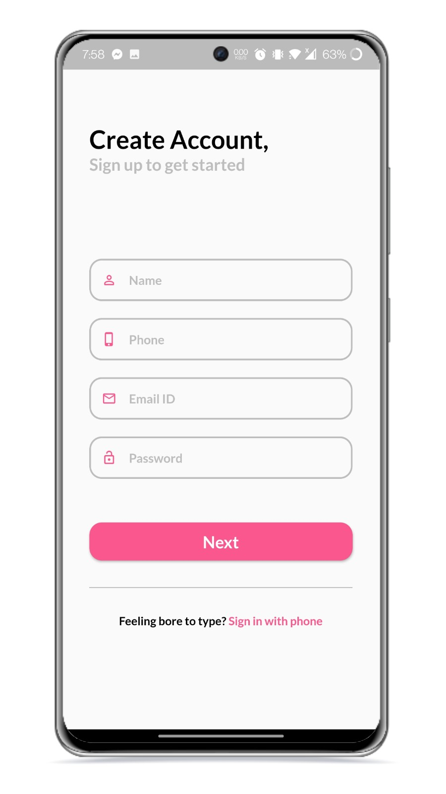
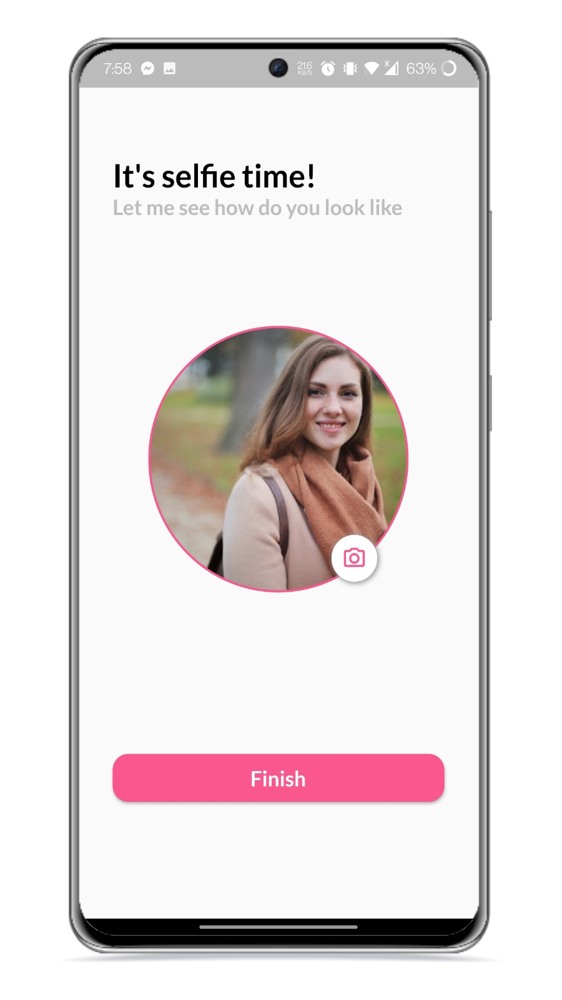

# Authentication

This app has been developed using Flutter.

## Contents
* Firebase Authentication
* Local Authentication
* Biometric Authentication
* Responsive UI
* GetX state management

# Screenshots

